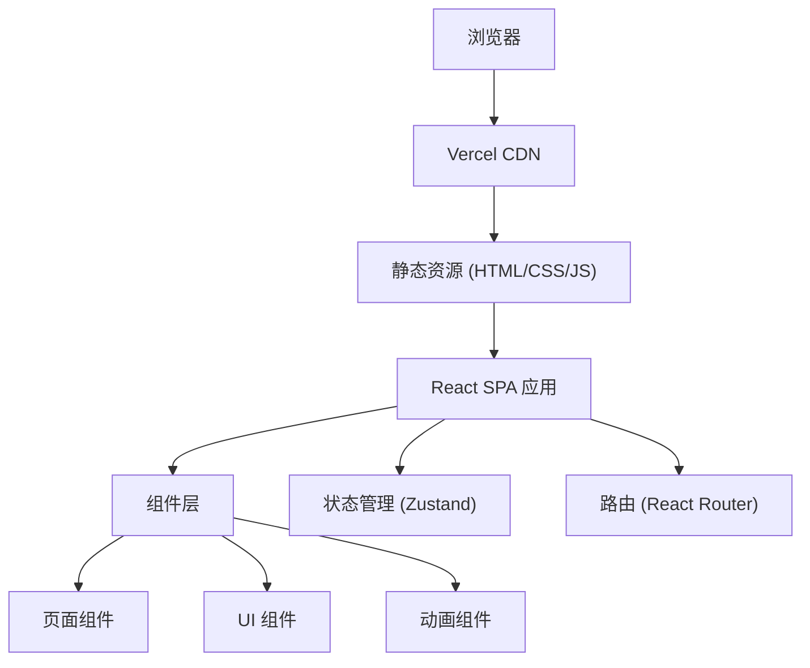

## 1. 架构设计



## 2. 技术说明
- 前端框架：React 18 + TypeScript
- 构建工具：Vite 5
- 样式方案：Tailwind CSS 3
- 路由管理：react-router-dom 6
- 状态管理：zustand
- 图标库：lucide-react
- 动画方案：CSS 动画 + Framer Motion（滚动触发、交互动效）
- 部署平台：Vercel
- 后端：纯前端，无后端，表单使用 Formspree 或静态展示

## 3. 路由定义
| 路由 | 用途 |
|-------|---------|
| / | 首页 - 产品展示、功能概览、数字驾驶舱 |
| /features | 功能详情 - 12大核心功能详细介绍 |
| /solutions | 解决方案 - 行业应用场景 |
| /about | 关于我们 - 公司介绍与团队 |
| /contact | 联系咨询 - 产品咨询表单 |

## 4. 项目结构
```
src/
├── components/          # 可复用组件
│   ├── layout/         # 布局组件（Navbar、Footer）
│   ├── ui/             # 基础UI组件（Button、Card等）
│   └── animations/     # 动画组件（滚动动画、数字滚动等）
├── pages/              # 页面组件
│   ├── Home.tsx
│   ├── Features.tsx
│   ├── Solutions.tsx
│   ├── About.tsx
│   └── Contact.tsx
├── hooks/              # 自定义 Hooks
│   ├── useScrollAnimation.ts
│   └── useCountUp.ts
├── data/               # 静态数据
│   ├── features.ts
│   └── solutions.ts
├── App.tsx             # 应用入口
├── main.tsx            # React 渲染入口
└── index.css           # 全局样式 + Tailwind
```

## 5. 核心技术选型理由
- **React + TypeScript**：类型安全，组件化开发，适合中大型官网项目
- **Tailwind CSS**：快速构建高质量UI，便于维护统一的设计系统
- **Framer Motion**：实现Apple级别的流畅动画，支持滚动触发、布局动画
- **Vite**：极速开发体验，构建效率高
- **lucide-react**：简洁现代的图标风格，与Apple风设计契合
